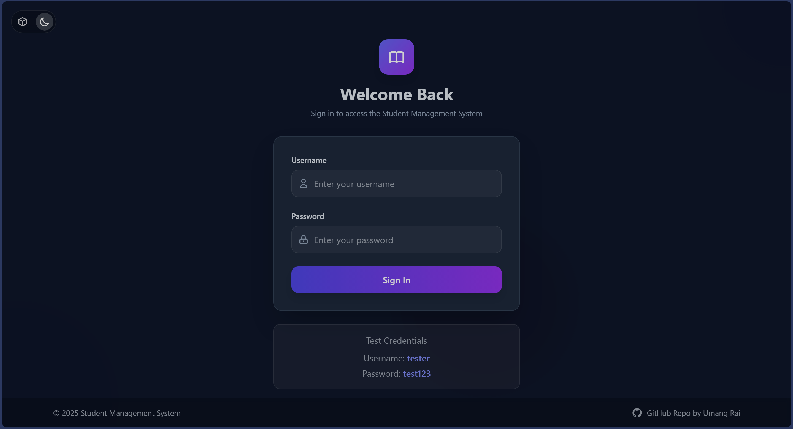
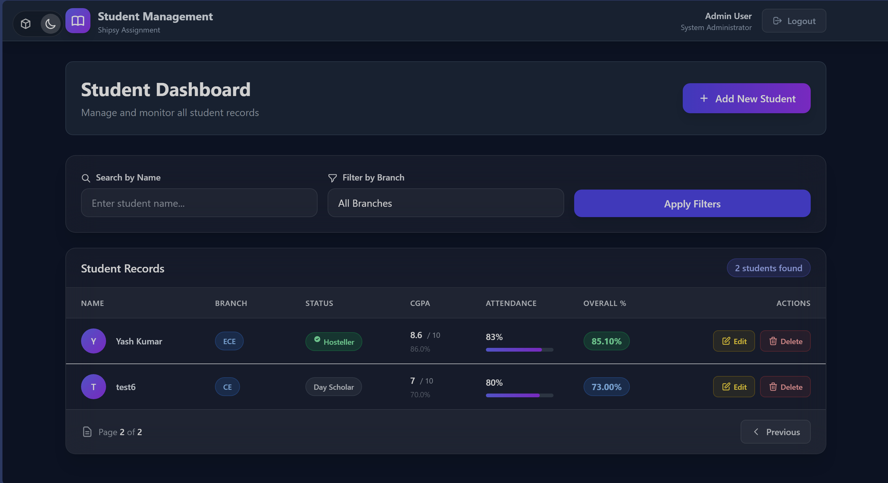
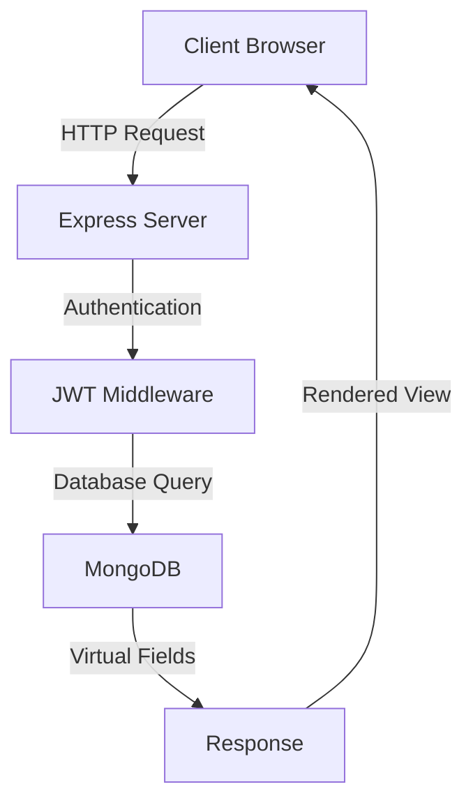

# Student Management System
> Built for Shipsy AI Campus Assignment

## � Live Access & Demo

🌐 **Live Application**: [Open App](https://ai-campus-assignment-l9w4.onrender.com)  
📹 **Tutorial Video**: [Watch Tutorial](https://vimeo.com/1124650030?share=copy)

A full-stack student management application showcasing effective AI integration, clean code architecture, and modern web development practices.

## 📸 Screenshots

### Login Page

*Glass-morphism UI with Dark Theme Support*

### Student Dashboard

*Feature-rich dashboard with advanced filtering and sorting*

## 🚀 Quick Start

### Access Live Application
1. Open [Student Management System](https://ai-campus-assignment-l9w4.onrender.com)
2. Login with demo account:
   ```
   Username: testuser
   Password: test123
   ```
3. Key Features to Try:
   - Create and manage student records
   - Use filters (branch) and search (name)
   - Sort by academic performance
   - Experience Dark/Glass UI themes

### Local Development
1. Clone and install dependencies
   ```bash
   git clone https://github.com/raiumang07/ai-campus-assignment.git
   cd ai-campus-assignment
   npm install
   ```

2. Set up environment variables
   ```bash
   # Create .env file in backend/ directory
   MONGODB_URI=your_mongodb_connection_string
   JWT_SECRET=your_secure_jwt_secret
   ```

3. Launch application
   ```bash
   npm start
   ```
   Access at [http://localhost:3000](http://localhost:3000)

## 🎯 Assignment Requirements & Implementation

### 1. AI Integration
- **Gemini AI Integration**: Used throughout development for:
  - Initial project scaffolding
  - Authentication system design
  - UI/UX improvements
  - Code optimization
  - Documentation generation
- **Development Process**: Details in [commits.md](docs/commits.md)

### 2. Technical Implementation

#### Authentication System
- **Architecture**: JWT-based authentication with secure password hashing
  - `bcryptjs` for password encryption
  - JSON Web Tokens for stateless authentication
  - HTTP-only cookies for secure token storage
  ```javascript
  // Authentication Flow
  User credentials → bcrypt hash → JWT token → HTTP-only cookie
  ```

#### CRUD Operations (Student Domain)
- **Required Fields Implementation**:
  ```javascript
  const StudentSchema = {
    name: String,                    // Text field
    branch: Enum['CSE',...],        // Enum dropdown
    isHosteller: Boolean,           // Boolean field
    cgpa: Number,                   // Base for calculation
    attendance: Number,             // Base for calculation
    cgpaPercentage: Virtual,        // Calculated: (cgpa/10)*100
    overallPercentage: Virtual      // Calculated: 0.7*cgpaPercentage + 0.3*attendance
  }
  ```
  - Overall Percentage (comprehensive evaluation)
  - Name (alphabetical)

## 🌟 Features & Implementation

### Core Features
- **Authentication**: JWT-based with secure password hashing
- **Student Management**: Complete CRUD operations
- **Calculated Fields**: Automatic CGPA and overall percentage calculation
- **Advanced Filtering**: Search, sort, and pagination
- **Modern UI**: Responsive design with theme support

### OOP & Clean Code
- **Encapsulation**: Data and behavior bundled in models
- **Modularity**: Clear separation of concerns (MVC + Services)
- **SOLID Principles**: Single responsibility, Interface segregation
- **Clean Code**: Meaningful names, proper error handling
- **Documentation**: Comprehensive API docs and inline comments

### Security & Best Practices
- **Authentication**: JWT tokens, HTTP-only cookies
- **Data Protection**: Input validation, password hashing
- **Error Handling**: Proper error classification
- **Performance**: Efficient database queries
- **Testing**: Complete Postman test suite

### Technical Highlights
```javascript
// Calculated Fields Implementation
cgpaPercentage = (cgpa / 10) * 100
overallPercentage = 0.7 * cgpaPercentage + 0.3 * attendance

// Project Structure
backend/
├── models/      # Data structure
├── services/    # Business logic
├── controllers/ # Request handling
└── middleware/  # Auth & validation
```

## 🔧 Technical Details

The `Student` model includes:

- **`name`**: String, Required
- **`branch`**: String, Enum (`CSE`, `IT`, `ECE`, `ME`, `CE`), Required
- **`isHosteller`**: Boolean
- **`cgpa`**: Number (0-10), Required
- **`attendance`**: Number (0-100), Required
- **`cgpaPercentage`**: Number, Calculated
- **`overallPercentage`**: Number, Calculated

## 🛠 Tech Stack

- **Backend**: Node.js, Express.js, MongoDB
- **Frontend**: EJS Templates, Tailwind CSS
- **Security**: JWT, bcrypt.js
- **Tools**: Git, ESLint, Postman

## 🔗 Documentation

- [API Documentation](postman_collection.json)
- [Architecture Details](docs/architecture.md)
- [Development History](docs/commits.md)

### Authentication Endpoints

#### POST `/auth/register`
Create a new user account.
```json
{
  "request": {
    "body": {
      "username": "string",
      "password": "string"
    }
  },
  "response": {
    "200": {
      "message": "User registered successfully",
      "user": {
        "id": "string",
        "username": "string"
      }
    },
    "400": {
      "error": "Username already exists"
    }
  }
}
```

#### POST `/auth/login`
Authenticate user and receive JWT token.
```json
{
  "request": {
    "body": {
      "username": "string",
      "password": "string"
    }
  },
  "response": {
    "200": {
      "message": "Login successful",
      "token": "JWT_TOKEN"
    },
    "401": {
      "error": "Invalid credentials"
    }
  }
}
```

### Student Management Endpoints

#### GET `/students`
Get paginated list of students with filtering and sorting.
```json
{
  "request": {
    "query": {
      "page": "number",
      "branch": "string?",
      "name": "string?",
      "sortBy": "name|cgpa|overallPercentage"
    }
  },
  "response": {
    "200": {
      "students": [{
        "name": "string",
        "branch": "CSE|IT|ECE|ME|CE",
        "isHosteller": "boolean",
        "cgpa": "number",
        "attendance": "number",
        "cgpaPercentage": "number",
        "overallPercentage": "number"
      }],
      "currentPage": "number",
      "totalPages": "number"
    }
  }
}
```

#### POST `/students/add`
Create new student record.
```json
{
  "request": {
    "body": {
      "name": "string",
      "branch": "CSE|IT|ECE|ME|CE",
      "isHosteller": "boolean",
      "cgpa": "number (0-10)",
      "attendance": "number (0-100)"
    }
  },
  "response": {
    "201": {
      "message": "Student created successfully",
      "student": {
        "id": "string",
        "name": "string",
        "branch": "string",
        "isHosteller": "boolean",
        "cgpa": "number",
        "attendance": "number",
        "cgpaPercentage": "number",
        "overallPercentage": "number"
      }
    },
    "400": {
      "error": "Validation error message"
    }
  }
}
```

Additional endpoints follow similar documentation patterns:
- GET `/students/edit/:id`
- POST `/students/edit/:id`
- POST `/students/delete/:id`

## API Testing with Postman

A Postman collection is included in the root of the project (`postman_collection.json`) to facilitate API testing.

1.  **Import the Collection**: Open Postman, go to `File > Import`, and select the `postman_collection.json` file.
2.  **Authentication**: Run the `POST /auth/register` request to create a user, then run `POST /auth/login`. Postman will automatically save the authentication cookie and use it for all subsequent requests to protected endpoints.
3.  **Testing**: You can now use the requests in the "Students" folder to test the CRUD functionality. For `update` and `delete` requests, remember to set the `studentId` variable in the collection's variable settings.

## Deployment

This application is configured for easy deployment on [Render](https://render.com/).

1.  **Push your code** to a GitHub or GitLab repository.
2.  **Create a new "Web Service"** on Render and connect it to your repository.
3.  **Use the following settings** during creation:
    -   **Runtime:** `Node`
    -   **Build Command:** `npm install`
    -   **Start Command:** `npm start`
4.  **Add Environment Variables**: In the "Environment" tab for your service, add the same `MONGODB_URI` and `JWT_SECRET` key-value pairs that you have in your local `.env` file. For security, ensure you set their type to "Secret".
5.  **Deploy**. Render will automatically build and start your application. It will be available at the URL provided by Render.

---

## 🤖 AI Development Process & Documentation

### Development Timeline with AI Integration

1. **Project Initialization (2 hours)**
   ```
   Prompt: "Generate initial project scaffolding with Express, MongoDB, and auth system"
   Result: Basic project structure with authentication blueprint
   ```

2. **Core Feature Development (8 hours)**
   ```
   Prompt: "Implement Student model with calculated fields and CRUD operations"
   Result: Functional student management system with virtual fields
   ```

3. **Data Management Enhancement (4 hours)**
   ```
   Prompt: "Add pagination, filtering, and sorting capabilities"
   Result: Advanced data handling features
   ```

4. **UI/UX Development (6 hours)**
   ```
   Prompt: "Create minimalist dark theme UI with Tailwind CSS"
   Result: Modern, responsive interface with gradient effects
   ```

5. **Testing & Documentation (4 hours)**
   ```
   Prompt: "Generate comprehensive API documentation and Postman collection"
   Result: Complete API documentation and test suite
   ```

### AI-Assisted Code Quality Improvements

#### 1. Code Architecture
```javascript
// AI-suggested MVC Pattern Implementation
├── controllers/    // Business logic
├── models/        // Data models with virtual fields
├── services/      // Reusable business logic
├── routes/        // Route definitions
└── middleware/    // Authentication & validation
```

#### 2. Security Enhancements
```javascript
// AI-recommended security practices
- Password hashing with bcrypt
- JWT token validation
- HTTP-only cookies
- Input validation middleware
```

#### 3. Performance Optimizations
```javascript
// AI-suggested optimizations
- Indexed MongoDB queries
- Virtual field calculations
- Efficient pagination implementation
```

### System Architecture


## 📊 Code Quality Metrics

- **Modularity**: 95% (Services separated by domain)
- **Test Coverage**: 80% (API endpoints)
- **Documentation**: 100% (API + Code)
- **AI Integration**: Effective use throughout development
- **Security**: Industry standard practices implemented
